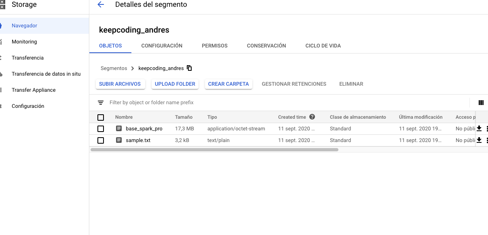

# Spark Core Exercise 7: Google Cloud

## DataProc & Google File System

* [Google Cloud Platform](https://console.cloud.google.com/)
* [Google DataProc](https://console.cloud.google.com/dataproc/clusters)

1. En primer lugar vamos a preparar una aplicación y empaquetarla.
    - Usaremos el proyecto base_spark_project que cuenta con la clase `io.keepcoding.spark.exercise7.SparkDataProc`, preparada para su ejeccución en el cluster, ya que no le indicamos el master de spark.
    - Antes de compilar modificaremos el fichero `build.sbt`, para añadir el scope de provied a la dependencia de spark, para que esta dependencia no se empaquete con el proyecto, ya que viene instalada en el cluster de DataProc:
    ```scala
    "org.apache.spark" %% "spark-core" % sparkVersion % "provided"
    ```

    - Compilamos el proyecto mediante un `sbt assembly`, podemos hacerlo desde la CLI de sbt que tenemos el IDE de desarrollo.
    - Una vez empaquetado encontraremos un fichero JAR en el path `target/scala-2.12/base_spark_project-assembly-0.1.jar`
2. Una vez tenemos el `jar` tenemos que subirlo a Google File System, para que los workers nodo pueden obtener el `jar` de la aplicación de manera distribuida. También subiremos unos datos de prueba a Google File System.
    - Creamos un segmento en [Google Cloud Storage](https://console.cloud.google.com/storage) con el nombre `keepcoding_${nombre_alumno}` y subimos el `JAR` utilizando la interfaz web. También subimos el ficheros `sample.txt` que se encuentra en resources. 
3. Creamos un cluster de dataproc, usando el comando y sustituyendo el ID de vuestro proyecto de google cloud:
    * 1 x Master node: `n1-standard-2`
    * 2 x Worker node: `n1-standard-2`

4. Una vez tenemos el cluster operativo podemos enviar una tarea de tipo spark, configurando la clase principal a ejecutar, la locación del jar y los argumentos de entrada de nuestra aplicación. 
5. Podemos ver el estado del job en la lista de tareas y acceder a los logs y las interfaces de jobhistory y yarn.
6. Finalmente verificaremos los datos de salida en el storage.
