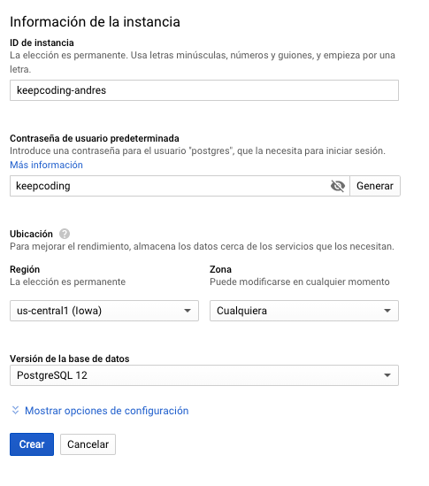

# Spark SQL: Exercise 4

En primer lugar vamos a hacer el despliegue de una base de datos relacional (PostgreSQL), usando el servicio Google SQL.
1. Entramos en [Google SQL](https://console.cloud.google.com/sql/instances)
2. Creamos una instancia de tipo PostgreSQL, usamos :
    - id: `keepcoding-${NOMBRE_ALUMNO}`
    - contraseña: `keepcoding`

    y esperamos a su creación, puede tardar unos minutos...
    
    
3. Una vez terminado el despliegue vamos a añadir una regla para poder conectarnos desde nuestra dirección IP pública.
    - Descubrimos cual es nuestra dirección IP: http://www.cualesmiip.com/
    - Copiamos la dirección y vamos a la sección de `Conexiones`, y en la sección `Conectividad`, le damos a
      `Añadir red`, indicamos un nombre para la red `casa` y añadimos nuestra dirección IP con la mascara, ejemplo:
      `1.1.1.1/32`, la mascara en este caso siempre es `/32`.

4. Una vez creado el despliegue y activada la conexión desde el exterior, vamos a comprobar la conexión y crear una 
   tabla con el schema del dataset de clase. Para ello vamos a usar la clase: `io.keepcoding.spark.sql.exercise4.ProvisionPostgresql`
   Donde tenemos que configurar la dirección IP pública en la variable `IpServer`. La provision ejecutarña:
   - Creación de una nueva tabla `instituto` con el schema de los datos del instituto:
   ```postgres-psql
   instituto(nombre TEXT, apellido TEXT, curso TEXT, clase TEXT, nota BIGINT)
   ```
   - Añadir un nuevo alumno, Federico Gonzalez, que pertenece a curso `idiomas` y tiene las clases: `italiano:8 ingles:7 frances:9`
   
5. Para verificar que ha funcionado correctamente nos conectaremos a la base de datos, la forma más sencilla es usar cloud shell
    ```bash
    gcloud sql connect keepcoding-${NOMBRE_ALUMNO} --user=postgres --quiet
    ```
   - Una vez establecida la conexión podemos comprobar los datos de la tabla mediante una sentencia SQL:
        ```postgres-psql
        SELECT * FROM instituto;
        ```
     
## Read data from Google SQL

En este ejercicio vamos a usar SparkSQL para leer los datos provisionados en la base de datos usando una conexión
JDBC, y los mostraremos por pantalla.

## Write data to Google SQL

1. En este ejercicio vamos a combinar los datos leidos en el apartado anterior con los ya disponibles del ejercicio 2, y
vamos a escribir todo el conjunto en la tabla de postgresl, sobreescribiendo su contenido.
2. Volveremos a comprobar mediante una sentencia SQL que los datos se han escrito correctamente en la base de datos.
    ```postgres-psql
    SELECT * FROM instituto;
    ```